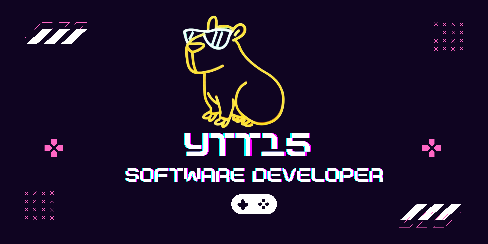

<h1 align="center">Hola, soy Yurley Loaiza 👋</h1>

  

## Sobre mi 

¡Bienvenido a mi rincón digital de descubrimiento y creación! Este es mi espacio dedicado a explorar los infinitos caminos del aprendizaje y la programación. Aquí encontrarás una colección de proyectos que reflejan mi pasión por los detalles, mi amor por convertir ideas en realidad y mi constante búsqueda de nuevas aventuras en el mundo del desarrollo. <b><i> Únete a mí mientras trazo mi propio camino en el vasto paisaje digital, compartiendo risas, conocimientos y el asombroso poder de la programación </i></b>

- 🔭  Actualmente trabajo en <b>Nexos Software SAS</b>
- 📲  Backend Developer
- 💬 Preguntame sobre <b>Java, Spring Boot, Spring Framework, AWS</b>
  

<!--- snake -->

  </a>

## Mis Stats 

<!--- stats & Trophy (start) -->

  <!--- stats (start) -->
<table align="center">
<tr border="none">
<td width="50%" align="center">
  
  
    
   
</td>

<td width="50%" align="center">

  
  
  </td>
</tr>
</table>
<!--- stats (end) -->

<!--- trophy (start) -->

    

      
    

<!--- trophy (start) -->

        
<!--- stats (end) -->

## Mi Stack 
<!--tech stack icons-->

  

## Conecta Conmigo 

<!--icons and links-->

